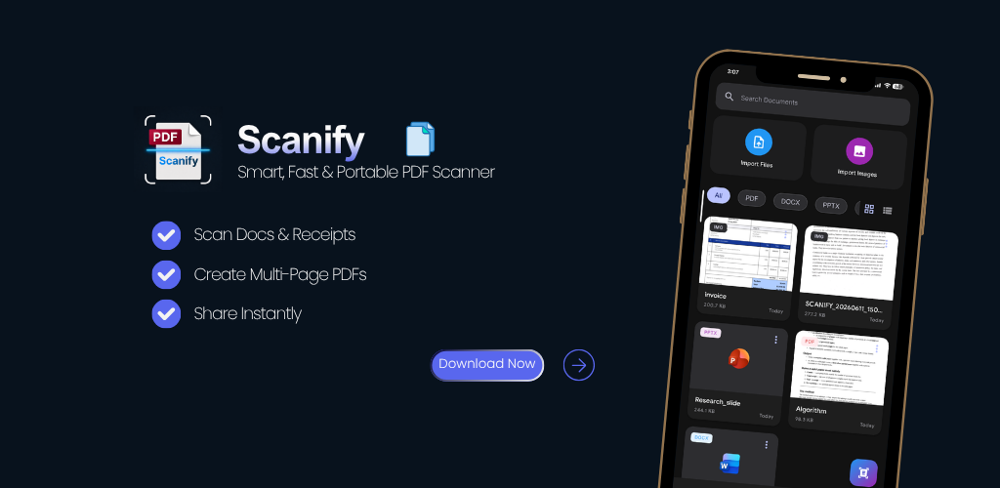
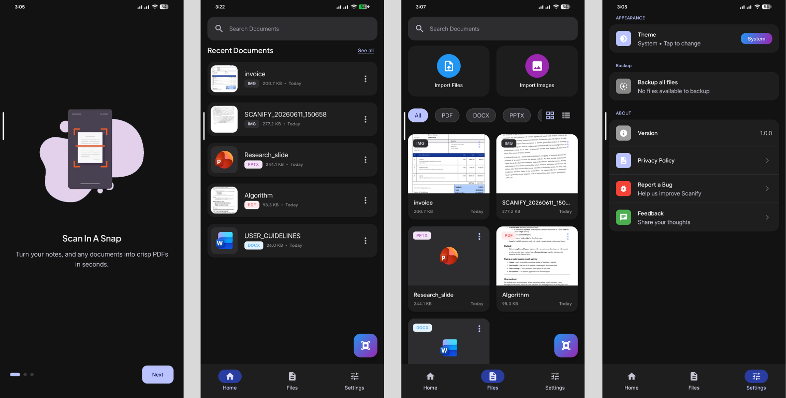
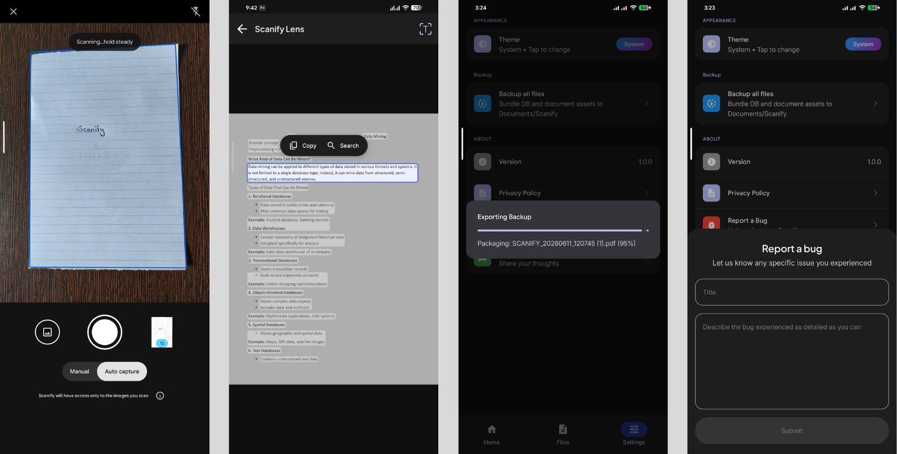

# Scanify: PDF & Document Scanner

Scanify is a sleek, fast, and privacy-focused document scanner and PDF maker built for Android. It operates under a strict **offline-first framework**, using on-device machine learning to detect edges, crop, and perform OCR (Optical Character Recognition) without ever uploading user data to a server.

Designed with modern Android development paradigms, Scanify respects user privacy by requesting **zero broad storage permissions**, utilizing native APIs to securely handle files.



<p align="center">
  <a href="https://play.google.com/store/apps/details?id=com.scanifylabs.scanner&pcampaignid=web_share" target="_blank">
    
  </a>
</p>

---

## 🛠 Tech Stack & Architecture

- **Language:** Kotlin
- **UI Framework:** Jetpack Compose (Material 3)
- **Architecture:** MVVM (Model-View-ViewModel) + Clean Architecture principles
- **Local Storage:** Encrypted Room Database (for metadata and local configurations)
- **Asynchronous Flow:** Kotlin Coroutines & StateFlow
- **On-Device ML:** Google ML Kit (Vision APIs for Text Recognition & Document Processing)
- **Storage/System Integration:** MediaStore API & Storage Access Framework (SAF)
- **Dependency Injection:** Hilt

---

## 🚀 Key Features

### 📄 High-Quality Scanning & Processing
- **Smart Edge Detection:** Automatically detects document borders and crops perfectly.
- **Perspective Adjustment:** Straightens skewed images for a flat, professional look.
- **Multi-Page Support:** Scan multiple pages or receipts sequentially and compile them into a single organized document.
- **Fast PDF Creation:** Convert physical documents into crisp PDF, JPG, or PNG files instantly.

### 🔍 On-Device OCR (Text Recognition)
- Processes text extraction entirely on-device using local **Google ML Kit** libraries.
- No digital assets, camera data, or extracted text are ever transmitted to the cloud.

### 🔒 Privacy-First Architecture
- **Offline-First Storage:** Uses a secure, sandboxed **Room Database** to store document history, states, and configurations internally.
- **Permissionless Media Exports:** Utilizes the native **MediaStore API** and **Storage Access Framework (SAF)**, allowing users to save files to public directories without granting the app global read/write access to device storage.
- **User-Controlled Sharing:** Employs standard Android System Sharing Intents (`Intent.ACTION_SEND`), leaving data transfers entirely under the user's control.

### 🎨 Modern UI/UX
- Dynamic **Light & Dark Themes** that automatically adapt to the system configuration.
- A clean, modern user interface optimized for speed and single-handed operations.

---

## 📸 App Screenshots





---

## ⚙️ Setup & Installation

Since Scanify relies entirely on native on-device APIs and platform dependencies provided by Google Play Services, it requires **zero external API keys** or backend deployments to run locally.

1. **Clone the repository:**
   ```bash
   git clone https://github.com/dipeshmhrzn/scanify-android.git
2. Open the project in **Android Studio**.
3. Let Gradle sync completely.
4. Build and run the application on an Android device or emulator running Android 8.0 (API 26) or higher.

## 📄 License

This project is licensed under the Apache License 2.0 - see the [LICENSE](LICENSE) file for details.

---

## 📬 Contact & Support
Developed by **Scanify Labs**. For architectural inquiries or technical feedback, reach out at [scanifylabs.dev@gmail.com](mailto:scanifylabs.dev@gmail.com).